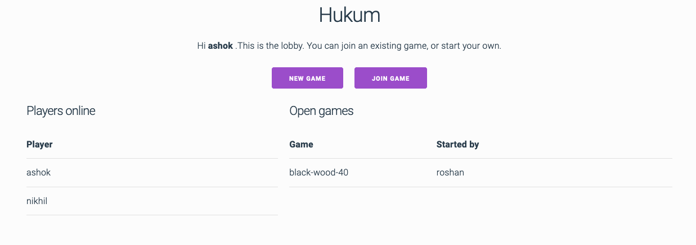
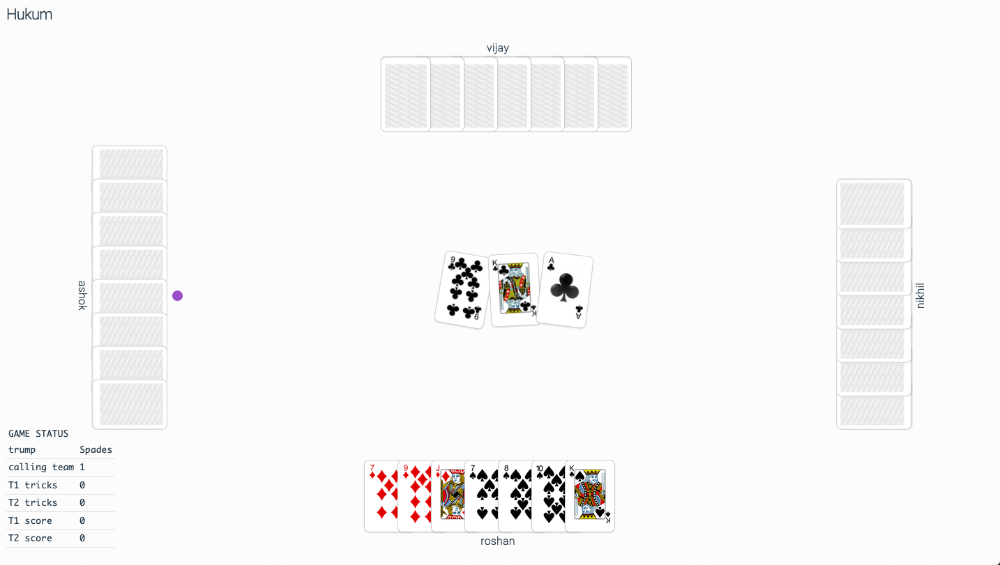

# Hukum

Hukum is a card game invented (I think) in India. I'm not sure how or when it started, but my family has been playing it since I was born and well before.

I have implemented a playable web version of the game made, available at
https://hukum.gigalixirapp.com/

The codebase for the game is made up of the following components:

* [*hukum-engine*](https://github.com/nsonnad/hukum-engine): An Elixir application that handles all the logic of the game. It receives incoming actions, such as a player passing or calling, or playing a card, and decides what to do next, returning a new game state at each step. This will be well-documented soon, because we need a master account somewhere of all the rules of Hukum!
* [*hukum-socket-api*](https://github.com/nsonnad/hukum-socket-api): This is a [Phoenix](https://www.phoenixframework.org/) app that establishes websocket connections between players, sends their actions to `hukum-engine` and broadcasts the new state at each step.
* [*hukum-elm-client*](https://github.com/nsonnad/hukum-elm-client): A frontend for the websocket server, written in [Elm](https://elm-lang.org/).

### Screenshots

Here's what the web version looks like.

This is the lobby.

This is a game.

### Running locally

To run the game locally, you may do the following:

1. Clone [*hukum-elm-client*](https://github.com/nsonnad/hukum-elm-client) and
   [*hukum-socket-api*](https://github.com/nsonnad/hukum-socket-api)
2. In the `hukum-socket-api` directory, run `mix deps.get` and then `mix phx.server`
3. In the `hukum-elm-client` directory, run `elm-app start`
4. Visit `localhost:3000`

Note that you will need 4 players to start a game.
